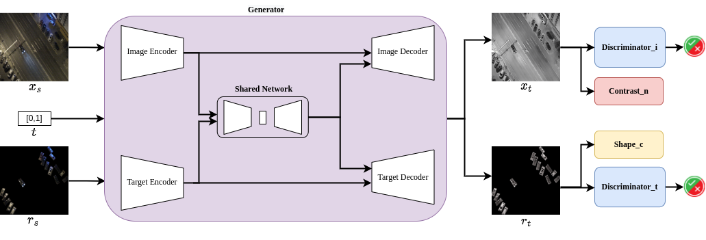

# StawGAN: Structural-Aware Generative Adversarial Networks for Infrared Image Translation
Official PyTorch repository for StawGAN: Structural-Aware Generative Adversarial Networks for Infrared Image Translation, ISCAS 2023

[[IEEEXplore](https://ieeexplore.ieee.org/document/10181838)][[ArXiv preprint](https://arxiv.org/abs/2305.10882)]

Luigi Sigillo, Eleonora Grassucci, and Danilo Comminiello

The link to the website presentation is [BlogPost](https://ispamm.github.io/StawGAN-page/)

### Abstract :bookmark_tabs:

This paper addresses the problem of translating night-time thermal infrared images, which are the most adopted image modalities to analyze night-time scenes, to daytime color images (NTIT2DC), which provide better perceptions of objects.
We introduce a novel model that focuses on enhancing the quality of the target generation without merely colorizing it. The proposed structural aware (StawGAN) enables the translation of better-shaped and high-definition objects in the target domain.
We test our model on aerial images of the DroneVeichle dataset containing RGB-IR paired images.
The proposed approach produces a more accurate translation with respect to other state-of-the-art image translation models.

### Model Architecture :clapper:


### How to run experiments :computer:

First, please install the requirements:

```pip install -r requirements.txt```


### Cite

Please cite our work if you found it useful:

```
@INPROCEEDINGS{10181838,
  author={Sigillo, Luigi and Grassucci, Eleonora and Comminiello, Danilo},
  booktitle={2023 IEEE International Symposium on Circuits and Systems (ISCAS)}, 
  title={StawGAN: Structural-Aware Generative Adversarial Networks for Infrared Image Translation}, 
  year={2023},
  volume={},
  number={},
  pages={1-5},
  doi={10.1109/ISCAS46773.2023.10181838}}
```


